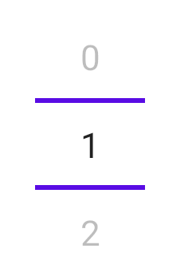
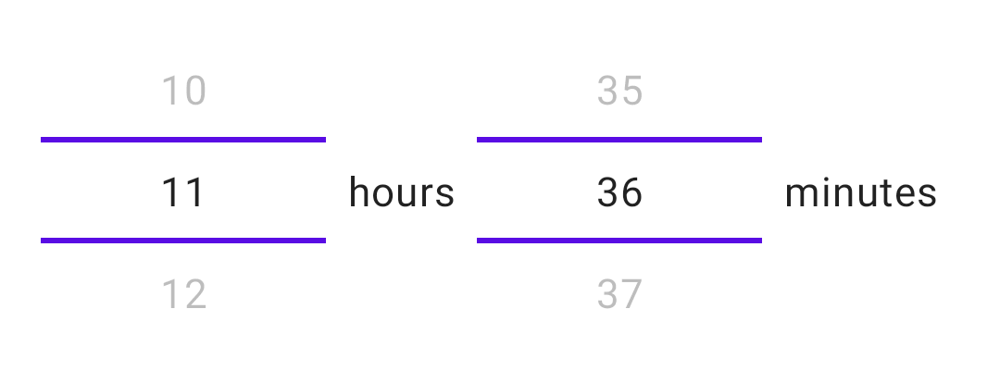
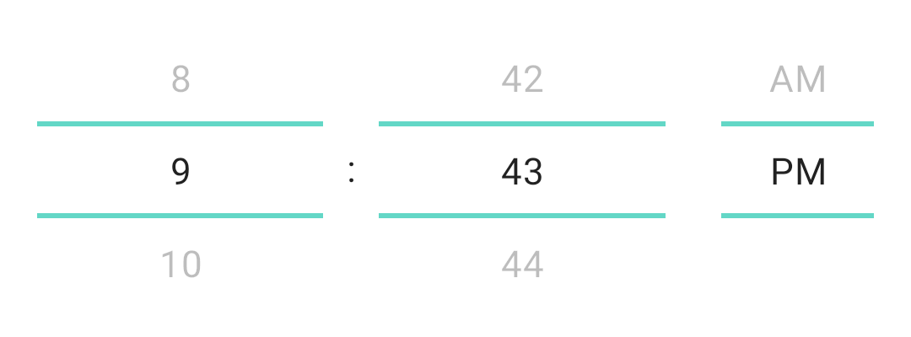
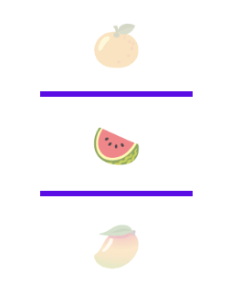

> [!WARNING]  
> This repository is archived, it is now avalaible at https://github.com/charge-map/Compose-NumberPicker

# Jetpack Compose Number Picker

Android library providing a Number Picker for Jetpack Compose.

[](https://chargemap.com)

[](https://mvnrepository.com/artifact/com.chargemap.compose/numberpicker)


## Showcase


## Installation

In your **module** *build.gradle* :

```
dependencies {
  implementation "com.chargemap.compose:numberpicker:latestVersion"
}
```

## Usage

### Simple NumberPicker



```
var pickerValue by remember { mutableStateOf(0) }

NumberPicker(
    value = pickerValue,
    range = 0..10,
    onValueChange = {
        pickerValue = it
    }
)

```

### 24 hours HoursNumberPicker



```
var pickerValue by remember { mutableStateOf<Hours>(FullHours(12, 43)) }

HoursNumberPicker(
    dividersColor = MaterialTheme.colors.primary,
    leadingZero = false,
    value = pickerValue,
    onValueChange = {
        pickerValue = it
    },
    hoursDivider = {
        Text(
            modifier = Modifier.size(24.dp),
            textAlign = TextAlign.Center,
            text = ":"
        )
    }
)

```

### AM/PM HoursNumberPicker



```
var pickerValue by remember { mutableStateOf<Hours>(AMPMHours(9, 12, AMPMHours.DayTime.PM )) }

HoursNumberPicker(
    dividersColor = MaterialTheme.colors.primary,
    value = pickerValue,
    onValueChange = {
        pickerValue = it
    },
    hoursDivider = {
        Text(
            modifier = Modifier.padding(horizontal = 8.dp),
            textAlign = TextAlign.Center,
            text = "hours"
        )
    },
    minutesDivider = {
        Text(
            modifier = Modifier.padding(horizontal = 8.dp),
            textAlign = TextAlign.Center,
            text = "minutes"
        )
    }
)

```

### List Picker



```
val possibleValues = listOf("🍎", "🍊", "🍉", "🥭", "🍈", "🍇", "🍍")
var state by remember { mutableStateOf(possibleValues[0]) }
ListItemPicker(
    label = { it },
    value = state,
    onValueChange = { state = it },
    list = possibleValues
)

```

## Contributors

| [](https://github.com/chargemap) | [Chargemap](https://github.com/chargemap) | Author |
|--------------|--------------|--------------|
| [](https://github.com/pandasys) | [Eric A. Snell](https://github.com/pandasys) | [Pull Request](https://github.com/ChargeMap/Compose-NumberPicker/pull/2) |
| [](https://github.com/pandasys) | [Christian R](https://github.com/cjrcodes) | [Pull Request](https://github.com/ChargeMap/Compose-NumberPicker/pull/8) |
