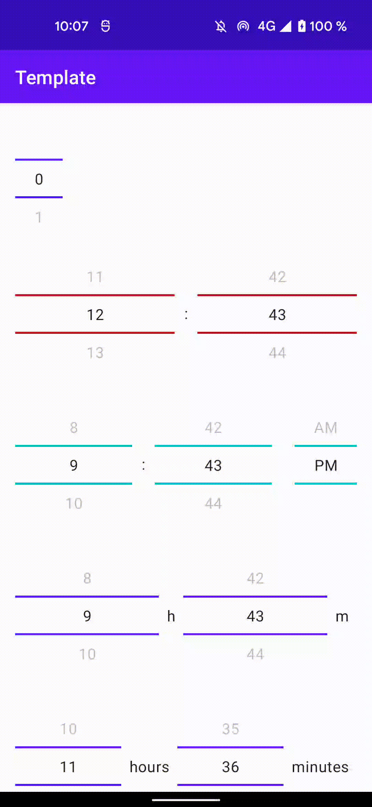

# Jetpack Compose Number Picker

Android library providing a Number Picker for Jetpack Compose.

[](https://chargemap.com)

[](https://maven-badges.herokuapp.com/maven-central/com.chargemap.compose/numberpicker)


## Showcase



## Installation

In your **module** *build.gradle* :

```
dependencies {
  implementation "com.chargemap.compose:numberpicker:latestVersion"
}
```

## Usage

### Simple NumberPicker

```
var pickerValue by remember { mutableStateOf(0) }

NumberPicker(
    value = pickerValue,
    range = 0..10,
    onValueChange = {
        pickerValue = it
    }
)

```

### 24 hours HoursNumberPicker

```
var pickerValue by remember { mutableStateOf<Hours>(FullHours(12, 43)) }

HoursNumberPicker(
    dividersColor = MaterialTheme.colors.primary,
    value = pickerValue,
    onValueChange = {
        pickerValue = it
    },
    hoursDivider = {
        Text(
            modifier = Modifier.size(24.dp),
            textAlign = TextAlign.Center,
            text = ":"
        )
    }
)

```

### AM/PM HoursNumberPicker

```
var pickerValue by remember { mutableStateOf<Hours>(AMPMHours(9, 12, AMPMHours.DayTime.PM )) }

HoursNumberPicker(
    dividersColor = MaterialTheme.colors.primary,
    value = pickerValue,
    onValueChange = {
        pickerValue = it
    },
    hoursDivider = {
        Text(
            modifier = Modifier.padding(horizontal = 8.dp),
            textAlign = TextAlign.Center,
            text = "hours"
        )
    },
    minutesDivider = {
        Text(
            modifier = Modifier.padding(horizontal = 8.dp),
            textAlign = TextAlign.Center,
            text = "minutes"
        )
    }
)

```

## Contributors

| [](https://github.com/r4phab) | [Raphaël Bertin](https://github.com/r4phab) |
|:------------------------------------------------------------------------------:|--------------|
